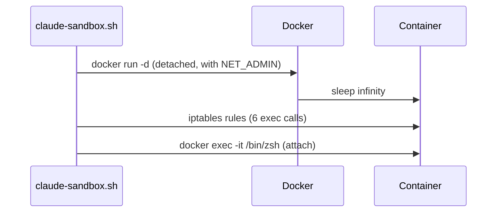

# Design Log #001: Network Isolation

**Date Created:** 2026-03-07
**Status:** Implemented

## Background

Running Claude Code in a container provides filesystem isolation, but the container still has full network access. For security-sensitive work, we want to restrict outbound traffic to only what Claude Code needs — the Anthropic API.

## Problem

How to optionally restrict container network access so Claude Code can function but can't reach arbitrary internet endpoints.

## Design

### Approach

Use iptables rules applied after container startup to create a whitelist-based firewall. The container starts with `--cap-add NET_ADMIN` to allow iptables manipulation, then rules are applied before the user gets a shell.

### Firewall Rules (in order)

1. Allow loopback traffic
2. Allow DNS (UDP port 53) — needed to resolve `api.anthropic.com`
3. Allow HTTPS to `api.anthropic.com`
4. Allow HTTPS to `anthropic.com`
5. Allow established/related connections (return traffic)
6. Drop everything else

### Startup Flow



Non-isolated mode skips the detached start and iptables setup, running `docker run -it` directly.

### CLI Interface

```bash
# Normal mode (full network)
./claude-sandbox.sh

# Isolated mode (Anthropic API only)
./claude-sandbox.sh --isolated
```

## Trade-offs

### Chosen: iptables with `--cap-add NET_ADMIN`
**Pros:**
- Simple, well-understood mechanism
- Rules applied after start, so no custom network driver needed
- Easy to inspect with `iptables -L`

**Cons:**
- Requires `NET_ADMIN` capability (slightly reduces container isolation)
- DNS-based rules resolve at rule-creation time — IP changes could break access
- 6 sequential `docker exec` calls adds ~1-2 seconds to startup

### Alternative: Custom Docker network with `--network`
**Pros:**
- No extra capabilities needed

**Cons:**
- More complex setup
- Harder to whitelist specific domains

**Why not chosen:** iptables is simpler and gives domain-level control.

## Implementation Results

### What Was Built
- `--isolated` flag in `claude-sandbox.sh`
- Flag parsing loop before the case statement
- Detached start → apply rules → attach flow for isolated mode
- `iptables` added to Dockerfile apt-get install

### Lessons Learned
- Container must start detached to apply iptables rules before the user gets a shell
- DNS must be allowed or domain-based HTTPS rules won't work
- `ESTABLISHED,RELATED` rule is critical — without it, return traffic from allowed connections gets dropped

## Related Design Logs
- [#000 - Project Overview](./000-project-overview.md)
