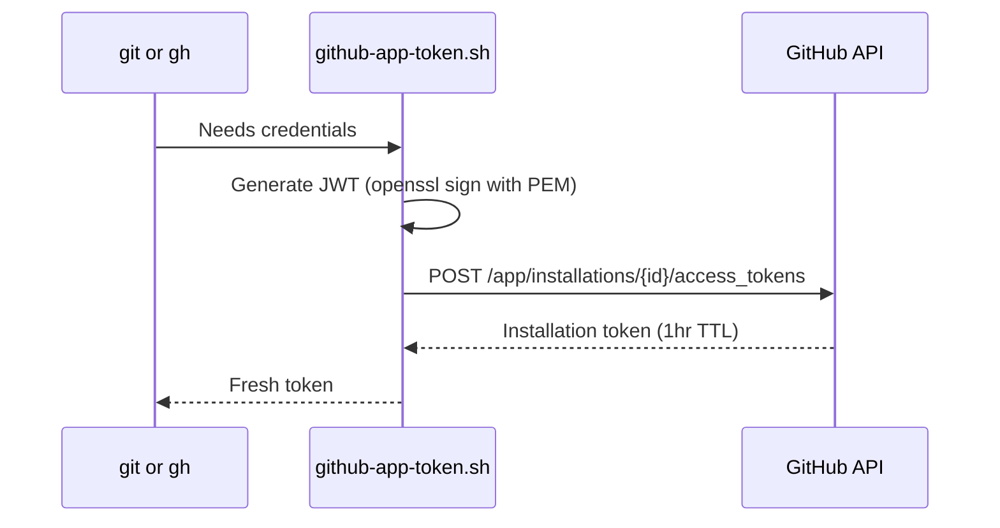

# Design Log #003: GitHub App Authentication

**Date Created:** 2026-03-07
**Status:** Implemented

## Background

The container needs to authenticate with GitHub for `git` (push/pull/clone) and `gh` CLI operations. The host uses Git Credential Manager (GCM), which isn't available inside the container. A GitHub App with a private key was created to handle authentication.

## Problem

How to authenticate `git` and `gh` inside the container using a GitHub App private key, without tokens expiring during long sessions.

## Questions and Answers

Q1: How long do GitHub App installation tokens last?
A: 1 hour. This means storing a static token at startup would fail for longer sessions.

Q2: Can we use the Client ID instead of the numeric App ID for JWT `iss` claim?
A: Yes. GitHub now supports using the Client ID as the `iss` value in JWTs.

Q3: Should the host `.gitconfig` be mounted or copied?
A: Copied at build time. The mounted read-only file prevented `git config --global` from working inside the container, which is needed to set up the credential helper.

## Design

### Token Flow

### How Each Tool Authenticates

- **git** - Custom credential helper (`github-app-token.sh`) configured via `git config --global credential.helper`. Git calls it with `get` on stdin, it returns fresh credentials.
- **gh** - Shell function wrapper in zshrc sets `GH_TOKEN` to a fresh token before each `gh` invocation.

### Environment Variables (set in `.env`)
- `GITHUB_APP_PEM` — path to the GitHub App private key `.pem` file on the host
- `GITHUB_APP_CLIENT_ID` — Client ID of the GitHub App (used as `iss` in JWT)
- `GITHUB_APP_INSTALLATION_ID` — Installation ID (found in the installation URL on GitHub)

### File Structure

- `github-app-token.sh` - Stateless token generator. Generates JWT, exchanges for installation token. Handles both direct calls (outputs token) and git credential helper protocol (outputs protocol/host/username/password).
- `github-app-auth.sh` - One-time setup. Configures `git config --global credential.helper`. Runs on first shell session in container.

## Trade-offs

### Chosen: GitHub App with on-demand token generation
**Pros:**
- Fine-grained permission control, scoped independently from the user
- No token expiry issues
- No stored credentials
- Works for sessions of any length

**Cons:**
- ~1 second overhead per git/gh operation (JWT generation + API call)
- Requires network access to `api.github.com`

### Alternative: Static token at startup
**Pros:**
- Simpler implementation
- No per-operation overhead

**Cons:**
- Expires after 1 hour
- Requires manual re-auth for long sessions

**Why not chosen:** Unreliable for long-running container sessions.

### Alternative: Personal Access Token (PAT)
**Pros:**
- Simple setup — just set a token env var
- No JWT generation overhead

**Cons:**
- Permissions are tied to the user, not the app — grants whatever the user has access to
- Long-lived token is a security risk if leaked
- No fine-grained, per-repository permission control

**Why not chosen:** GitHub App allows fine-grained permission control scoped independently from the user's own access. Better security model for a sandboxed environment.

## Implementation Results

### What Was Built
- `github-app-token.sh` - Generates fresh tokens using openssl for JWT signing
- `github-app-auth.sh` - Configures git credential helper on first shell
- `gh` shell wrapper in zshrc for dynamic `GH_TOKEN`
- `.env` / `.env.sample` for GitHub App configuration
- `.gitconfig` copied at build time instead of mounted read-only
- Network isolation updated to allow `github.com` and `api.github.com`

### Deviations from Design
1. **Switched from App ID to Client ID** - GitHub now supports Client ID as the JWT `iss` claim
2. **Removed `.gitconfig` mount** - Replaced with build-time copy to allow `git config --global` writes inside container
3. **Used `--replace-all`** - Host `.gitconfig` includes GCM credential helper; needed `--replace-all` to override it cleanly

### Lessons Learned
- Mounted read-only files can't be modified inside the container — if you need to write to a config, copy it at build time
- `git config` with multiple `credential.helper` values requires `--replace-all` to overwrite
- `~` doesn't expand when sourced from a file — use `${VAR/#\~/$HOME}` for path variables loaded from `.env`

## Related Design Logs
- [#000 - Project Overview](./000-project-overview.md)
- [#001 - Zsh Setup](./001-zsh-setup.md)
